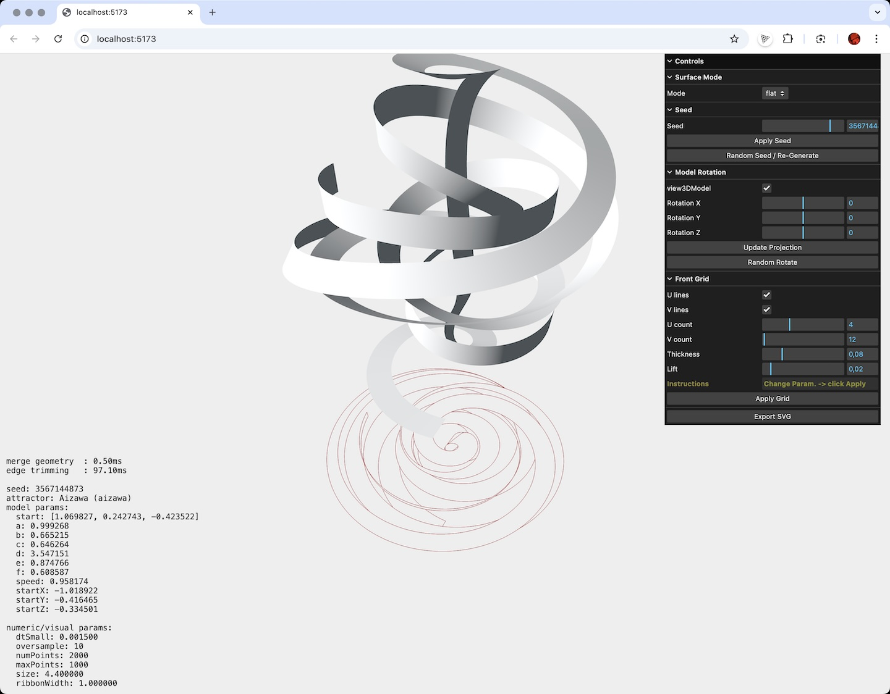

# Attractor Projection SVG

An interactive 3D visualization tool that generates complex attractor surfaces and exports their 2D projections as SVG files.
Built with [Three.js](https://threejs.org/), it supports multiple attractor types (Aizawa, Thomas, Lorenz, Chen, Dadras, Rossler, Sprott) and customizable grid/ribbon rendering.

## Project Status
**Work in Progress** – This project is functional but not perfect. There are areas for optimization and improvement. Contributions and feedback are welcome!



## Features
- **Multiple Attractor Models** – Choose from various chaotic systems with adjustable parameters.
- **3D Visualization** – Rotate, zoom, and inspect surfaces in real time.
- **Grid and Ribbon Modes** – Switch between flat surfaces and ribbon-like geometry with grid overlays.
- **Seed Control** – Generate reproducible random variations with a seed value.
- **Projection Generation** – Automatically compute the orthogonal projection of the 3D geometry.
- **SVG Export** – Save high-quality vector graphics of the projection for further editing or printing.
- **Full-Screen Capture** – Export combined WebGL + overlay display as an image.

## Installation
1. **Clone the repository**
   ```bash
   git clone https://github.com/jeonghopark/Attractor_Projection_SVG.git
   cd Attractor_Projection_SVG
   ```

2. **Install dependencies**
   ```bash
   npm install
   ```

3. **Run development server**
   ```bash
   npm run dev
   ```

4. **Build for production**
   ```bash
   npm run build
   ```

## Usage
- Open the app in your browser (`npm run dev` will show the local URL).
- Use the **GUI panel** to:
  - Select **Surface Mode** (`flat` or `ribbons`).
  - Change the **Seed** or randomize it.
  - Adjust **3D model rotation** or apply a random rotation.
  - Modify **Grid/Ribbon parameters** (U/V lines, thickness, height).
  - Export the current projection as **SVG**.

## Controls
- **Mouse drag** – Rotate the view.
- **Mouse wheel / Pinch** – Zoom in/out.
- **Right-click drag** – Pan the camera.

## File Structure
- `main.js` – Main application logic, scene setup, GUI handling, and SVG export.
- `AttractorSurface.js` – Attractor curve generation, ribbon surface building, and grid geometry creation.
- `AttractorRegistry.js` – Definitions and parameters for each attractor model.
- `index.html` – Application entry point.
- `package.json` – Project dependencies and scripts.

## Dependencies
- [Three.js](https://threejs.org/) – 3D rendering
- [lil-gui](https://lil-gui.georgealways.com/) – GUI controls
- [clipper2-js](https://github.com/AngusJohnson/Clipper2) – Geometry processing
- [three-mesh-bvh](https://github.com/gkjohnson/three-mesh-bvh) – Mesh acceleration structures

## Acknowledgments
Special thanks to the incredible [Three.js](https://threejs.org/) library and the outstanding [three-mesh-bvh](https://github.com/gkjohnson/three-mesh-bvh) project for making high-performance geometry processing and rendering possible.

## License
MIT © 2025 JeongHo Park
